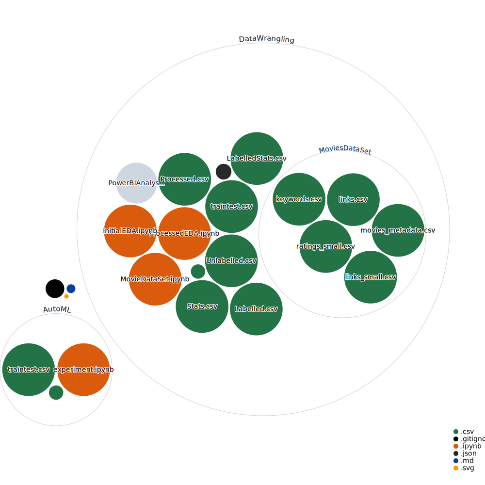

# DieHardSolver
A data science experiment to determine if Die Hard is a Christmas movie

## Sources

https://www.kaggle.com/rounakbanik/the-movies-dataset

## Repository Visualization

[View interactive Diagram](https://octo-repo-visualization.vercel.app/?repo=integerman%2FDieHardSolver)